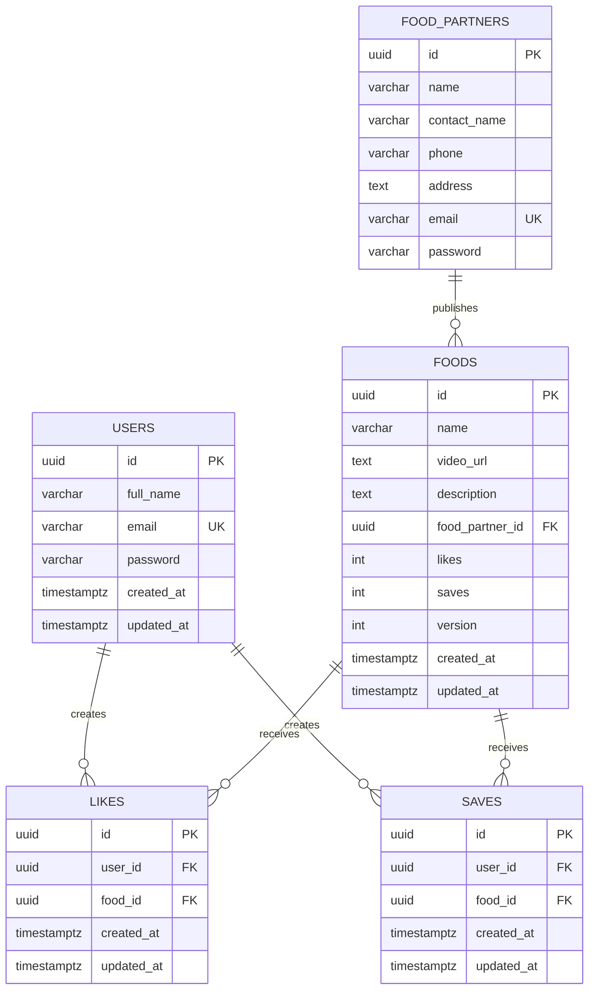

# MongoDB → PostgreSQL Migration Notes

## ER Diagram

## Design Decisions

### UUID primary keys

MongoDB `ObjectId` values are opaque strings in the frontend (`_id`). PostgreSQL uses `UUID` primary keys exposed in JSON as `_id` to preserve the frontend contract without embedding Mongo ObjectId format.

### Separate `users` and `food_partners` tables

MongoDB stored users and food partners in separate collections with independent ID namespaces. The same JWT payload shape `{ id }` resolves against the appropriate table in middleware — identical authorization behavior.

### Food partners have no timestamps

The Mongoose `foodpartner` schema did not enable `timestamps`. The PostgreSQL `food_partners` table intentionally omits `created_at` / `updated_at` so profile responses match the original shape.

### Denormalized `likes` and `saves` counters on `foods`

MongoDB stored counter fields on the food document and maintained join collections for per-user state. PostgreSQL keeps the same pattern: `foods.likes` / `foods.saves` counters plus `likes` / `saves` junction tables with `UNIQUE(user_id, food_id)`.

### `version` column maps to Mongoose `__v`

Food documents in API responses include `"__v": 0`. PostgreSQL stores this as `foods.version` with default `0`.

### Foreign keys with CASCADE

Deleting a user, partner, or food cascades to related likes/saves/foods — stronger integrity than MongoDB references without changing API behavior for normal operations.

### No JSONB

All fields are relational columns. No embedded documents existed in MongoDB that required JSONB.

### Indexes

| Index | Purpose |
|---|---|
| `users.email` UNIQUE | Login & duplicate registration check |
| `food_partners.email` UNIQUE | Partner login & duplicate registration |
| `likes(user_id, food_id)` UNIQUE | Toggle like idempotency |
| `saves(user_id, food_id)` UNIQUE | Toggle save idempotency |
| `foods.food_partner_id` | Partner dashboard & profile queries |
| `saves.user_id` | Saved foods feed |

## Collection Mapping

| MongoDB Collection | PostgreSQL Table |
|---|---|
| `users` | `users` |
| `foodpartners` | `food_partners` |
| `foods` | `foods` |
| `likes` | `likes` |
| `saves` | `saves` |

## API Compatibility Verification

| Endpoint | Method | Status | Request | Response | Verified |
|---|---|---|---|---|---|
| `/api/auth/user/register` | POST | 201 / 400 / 500 | `{ fullName, email, password }` | `{ message, user: { _id, fullName, email } }` + cookie | Yes |
| `/api/auth/user/login` | POST | 200 / 400 / 500 | `{ email, password }` | `{ message, user }` + cookie | Yes |
| `/api/auth/user/logout` | GET | 200 | — | `{ message }` + cleared cookie | Yes |
| `/api/auth/food-partner/register` | POST | 201 / 400 / 500 | `{ name, email, password, phone, address, contactName }` | `{ message, foodPartner: { _id, name, email } }` + cookie | Yes |
| `/api/auth/food-partner/login` | POST | 200 / 400 / 500 | `{ email, password }` | `{ message, foodPartner }` + cookie | Yes |
| `/api/auth/food-partner/logout` | GET | 200 | — | `{ message }` + cleared cookie | Yes |
| `/api/food` | POST | 201 / 400 / 500 | multipart: `name`, `description`, `mama` (video) | `{ message, food }` | Yes |
| `/api/food` | GET | 200 / 500 | — | `{ foods: [...] }` populated partner | Yes |
| `/api/food/like` | POST | 200 / 201 / 500 | `{ foodId }` | `{ message }` | Yes |
| `/api/food/save` | POST | 200 / 201 / 500 | `{ foodId }` | `{ message }` | Yes |
| `/api/food/save` | GET | 200 / 500 | — | `{ foods: [...] }` | Yes |
| `/api/food/partner/stats` | GET | 200 / 500 | — | `{ totalReels, totalLikes, totalSaves, avgEngagement }` | Yes |
| `/api/food-partner/:id` | GET | 200 / 404 | — | `{ message, foodPartner: { ..., foodItems } }` | Yes |
| `/` | GET | 200 | — | plain text health check | Yes |

## Auth Parity

- JWT stored in httpOnly `token` cookie
- Cookie flags: `Secure`, `SameSite=None`, 7-day max age
- JWT payload: `{ id: "<uuid>" }` (no expiry — matches original `jwt.sign` without `expiresIn`)
- bcrypt cost: 10

## Data Migration (existing MongoDB → PostgreSQL)

This repository provides schema and application code only. To migrate existing data:

1. Export MongoDB collections to JSON
2. Map `_id` → `id` (UUID). You may generate new UUIDs and maintain a mapping table if you need to preserve external references
3. Import into PostgreSQL respecting foreign key order: `food_partners` → `users` → `foods` → `likes` / `saves`
4. Verify counter fields (`likes`, `saves`) match junction table counts

## Known Behavioral Notes

- Invalid UUID in `/api/food-partner/:id` returns `404` (same as Mongoose invalid ObjectId)
- Auth `500` responses include `"error": {}` matching Express `JSON.stringify(Error)`
- `avgEngagement` is a string with one decimal when reels exist, number `0` when empty (matches `toFixed(1)`)
